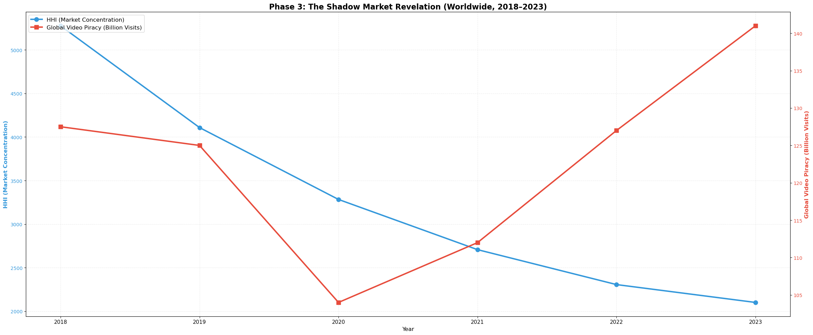

### This is a project built as a study for *Saarland University's* program **“Data and Society”**. We argue that digital media piracy is a predictable market correction. We hypothesize piracy emerges when market failures, specifically price disparity, fragmentation, and poor preservation fail consumers.

[](https://jupyter.org/)
[](https://www.python.org/)

## **Key findings**

**1. Fragmentation, not poverty, tracks the piracy surge.** As the global streaming market fragmented from 2018 to 2023 (HHI fell 60%, from 5,276 to 2,101 on Parrot Analytics demand-share data), actual piracy visits rose 10.6% to an all-time high of 141 billion (MUSO). Meanwhile Google searches for piracy *declined*; we call this the Google Trends paradox. Piracy stopped being something people search for and became infrastructure (Stremio, IPTV boxes, Telegram channels), which is exactly what a maturing shadow market looks like.



**2. Wealth does not predict piracy.** Across 122 countries, income per hour worked (World Bank GDP per capita in current US$, divided by average annual working hours, a rough wage proxy) explains about 1% of the variance in piracy search volume (OLS R² = 0.013; Spearman ρ = −0.001, p = 0.99). This falsification test rules out the "piracy is just poverty" explanation and strengthens the fragmentation story above.

**3. Delistings trigger archival piracy.** An event study across ~70 delisted games shows piracy search interest peaking within roughly ±15 days of the delisting event (month-level date granularity), consistent with piracy acting as a preservation mechanism for media that is going extinct.

**The takeaway:** piracy behaves like a barometer for market failure. The industry beats it by competing on service (centralized, frictionless, permanent access), not by enforcement.

## **Team**

Built by Team 5 for the Data and Society seminar: **Akshay Ashok**, **Ali Haider Khan** and **Vishakh Kantharaj**.

- **Akshay Ashok**: fragmentation barrier (Parameter 2), HHI computation on Parrot Analytics and Sandvine data, MUSO alignment, Google Trends collection via pytrends, report integration
- **Ali Haider Khan**: economic barrier (Parameter 1), wage and income data engineering, correlation analysis
- **Vishakh Kantharaj**: original Shadow Correction concept and preservation barrier (Parameter 3), delisting event study

## **Dependencies**

One command gets you everything:
 ```sh
 pip install -r requirements.txt
 ```

Or piece by piece, if that's how you like living:

**Pandas**: You know what pandas is for
 ```sh
 pip install pandas
 ```

 **Numpy**: math and whatnot
 ```sh
 pip install numpy
 ```

 **MatplotLib**: graphs and whatnot
 ```sh
pip install matplotlib
 ```

 **Seaborn**: Used to create and vizualize graphical data
 ```sh
pip install seaborn
 ```

 **Pytrends**: Unofficial API to query google trends
 ```sh
pip install pytrends
 ```

 **SciPy**: Fundamental algorithms for scientific computing in Python
 ```sh
pip install scipy
 ```

 **StatsModels**: Statistical computations and models for Python
 ```sh
pip install statsmodels
 ```


## **Structure**

#### The repo contains 3 main folders each necessary to be able to reproduce the study locally please keep the names of the folders unchanged.

 - **Data-sets**: contains all the extracted datasets for the study

 - **Scripts**: contains the necessary python files to be able to generate some of the data required for the final analysis

 - **Results**: contains the result generated during our self-analysis (Final report based on these results)

 - **assets**: plots exported from the report notebook for this README


## **Setup** 

#### Follow these steps to setup and run the tests on your local device.

 1. Read this file ( Du bist **Smart** :O )
 2. **download** the latest release of python and jupyter notebook from thier official pages (*links above*) 

 3. **download** the latest release this should give you all the necessary files

 4. **Install** all the **dependencies** mentioned above using the pip command

 5. Proceed to **"Scripts"** folder (This will be your root folder to run some of the data gen)

 6. Follow the instructions in **"scripts-readme.txt"** to run the data generation process
    
#### **P.S** if you just want to see the final results and project analysis instead run the "*project_report.ipynb*" file

## **Honest limitations**

The global fragmentation correlation runs on n = 6 years, so the directional trend (HHI −60%, piracy +10.6%) is clear but the correlation itself is not statistically significant. Sandvine changed measurement methodology in 2017. COVID (2020) is an anomaly we handle with a robustness check. Delisting dates only have month-level precision. Full discussion in section 2.8 of the report notebook.
